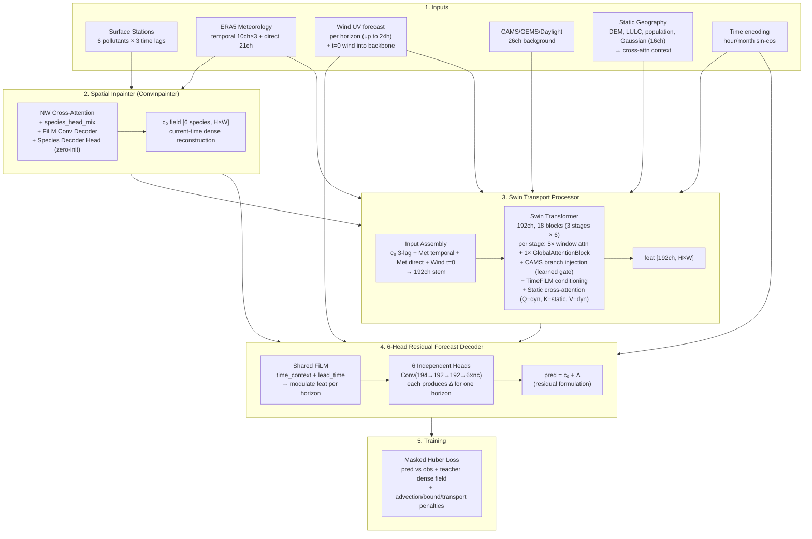
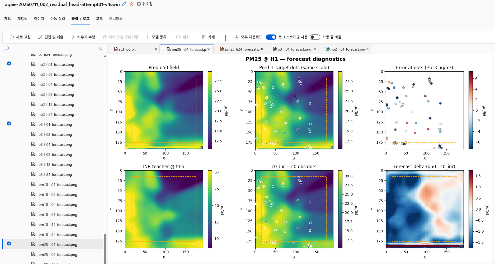
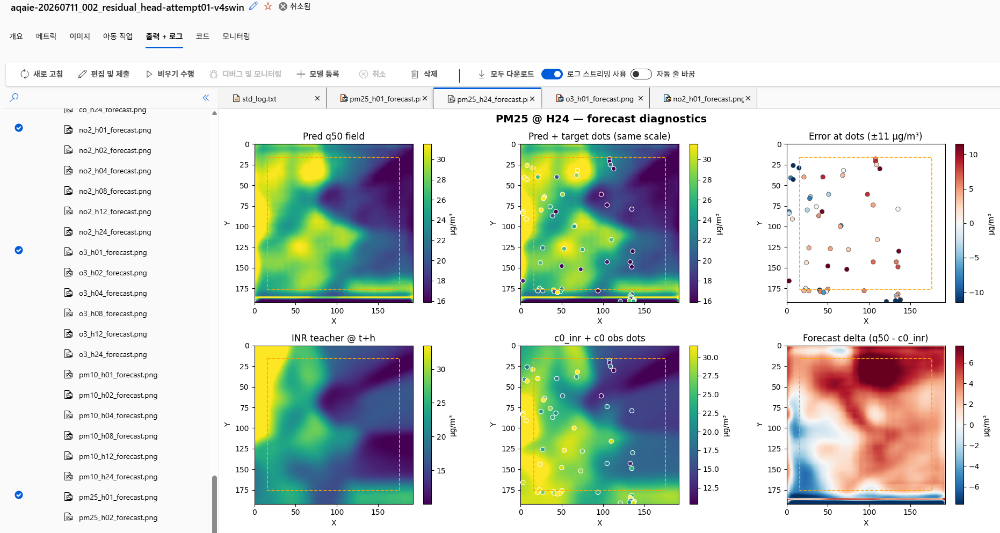

# AQAIE

**A physics-informed framework for atmospheric state reconstruction and air quality forecasting.**

---

## About This Project

AQAIE is a research project exploring atmospheric state reconstruction and air quality forecasting from sparse monitoring networks.

The project combines meteorological data, environmental covariates, and physics-informed learning to reconstruct high-resolution pollutant fields and predict their temporal evolution.

Unlike conventional approaches that rely on dense model-generated target fields, AQAIE is designed around sparse real-world observations and focuses on learning physically consistent spatial and temporal representations.

---

## The Problem

Air quality observations are inherently sparse. Ground monitoring stations provide accurate measurements, but only at a limited number of locations, while pollutant concentrations evolve continuously in space and time under the influence of meteorology, emissions, and atmospheric transport.

This creates an ill-posed reconstruction problem: how can a model infer a physically consistent high-resolution pollutant field from sparse observations and environmental data?

AQAIE explores whether neural assimilation and physics-informed learning can recover latent atmospheric structure and forecast its future evolution without relying on a full chemical transport simulation during inference.

---

## Architecture

---

## Core Ideas

1. Reconstruct a dense concentration field from sparse monitoring stations.
2. Forecast the reconstructed field rather than forecasting stations directly.
3. Use physics-informed regularization only where observations are absent.
4. Treat coarse-scale model products as optional priors through learned gating.
5. Diagnose artifacts visually and suppress them with targeted architectural changes.
6. Allow per-species structural differentiation at both the assimilation and forecasting stages.

---

## Evaluation

Primary metric: Leave-K-Out (LKO) station validation.

LKO measures spatial generalization by withholding monitoring stations during validation and predicting concentrations at unseen locations.

Current experiments achieve:

* PM2.5 LKO RMSE: ~0.076–0.081 (normalized space)
* Overall R²: ~0.77 across pollutants and forecast horizons

---

## Repository Structure

Selected components are included to illustrate data pipeline and the architecture.

### Data Pipeline

| Component | Description |
|------------|-------------|
| `build_era5_31ch.py` | ERA5 / ERA5-Land processing and grid harmonization |
| `build_airkorea_parquet.py` | Sparse station dataset construction |
| `preprocess_pop_1km.py` | Population raster preprocessing and aggregation |

### Modeling (current)

| Component | Description |
|------------|-------------|
| `obs_conv_inpainter.py` | Sparse-to-dense assimilation via NW cross-attention, FiLM decoder, and per-species differentiation |
| `backbone_swin.py` | Swin Transformer backbone with GlobalAttentionBlock and StaticCrossAttention |
| `local_residual_head.py` | 6 independent horizon heads with shared FiLM conditioning and residual formulation |
| `branch_cams.py` | CAMS/GEMS gated injection with learned gate |
| `fusion.py` | Temporal 3D meteorological encoder with FiLM conditioning |
| `conv_blocks.py` | Shared convolutional building blocks |

### Modeling (legacy — prior architecture)

| Component | Description |
|------------|-------------|
| `obs_sparse_inr.py` | Earlier INR using Fourier features and distance-aware top-k cross-attention |
| `backbone_unet.py` | U-Net forecasting backbone with FiLM conditioning |
| `head_multi_horizon.py` | Multi-horizon head with base + cumulative delta formulation |
| `losses.py` | Physics-informed and uncertainty-aware training losses |

---

## Design Evolution

The current architecture emerged through a series of revisions driven by a single constraint:

**forecasting dense air-quality fields from sparse monitoring stations.**

Unlike weather forecasting systems trained on dense reanalysis grids, supervision is available only at observation locations. Most architectural decisions were introduced to address limitations created by this sparse-observation setting.

---

### 1. Baseline: End-to-End Forecasting

The initial baseline was motivated by recent advances in end-to-end, data-driven weather forecasting systems. Aardvark Weather [1] demonstrated an observation-driven forecasting framework that reduces dependence on traditional numerical weather prediction components by directly learning from heterogeneous observational inputs. Pangu-Weather [2] introduced a hierarchical multi-step forecasting architecture based on temporal aggregation, where forecasts at multiple lead times are constructed through structured intermediate representations rather than naive step-by-step autoregressive rollouts.

Following these ideas, a U-Net backbone was designed to consume meteorological inputs, static features, and station observations, producing multi-horizon forecasts in a single forward pass. A direct multi-horizon decoding strategy was adopted instead of iterative temporal rollout, motivated by two considerations in the sparse-observation setting: (1) error propagation in iterative forecasting is amplified when supervision is available only at irregular station locations, and (2) computational efficiency is important for potential deployment under constrained hardware settings.

While this approach achieved reasonable station-level predictive performance, it struggled to generate physically consistent spatial fields away from observation locations due to limited spatial supervision and weak inductive bias over continuous fields.

---

### 2. Sparse Observations Require Explicit Assimilation

Early experiments revealed a fundamental mismatch between sparse monitoring stations and convolutional architectures.

A handful of station measurements distributed across a large spatial domain provide insufficient spatial support for dense field reconstruction.

To address this limitation, a dedicated sparse-to-dense assimilation stage was introduced before the forecasting backbone.

The resulting INR module reconstructs a dense concentration field from sparse station observations [11] using Fourier positional encoding [9] and implicit field representation principles [10].

This reconstructed field acts as an observation anchor for downstream forecasting.

---

### 3. Physics as a Constraint, Not a Simulator

Even after dense reconstruction, large portions of the spatial domain remain weakly supervised.

Rather than attempting to emulate a full chemical transport model, the project uses lightweight physics-informed constraints to regularize solutions in these regions.

The design follows the PINN framework [7] while accounting for known failure modes of advection-dominated systems [6].

Current constraints include:

* advection consistency
* semi-Lagrangian consistency
* observation assimilation
* uncertainty-aware quantile regression
* spatial smoothness and stability regularization

The objective is not numerical simulation, but reduction of physically implausible solutions under sparse supervision.

---

### 4. Artifact Analysis Became a Research Problem

Several training runs exhibited checkerboard patterns [3], lattice artifacts, and high-frequency texture amplification.

Rather than treating these as generic deep-learning failures, the transmission paths were analyzed directly.

This investigation led to:

* anti-alias filtering of meteorological inputs [4]
* skip-path filtering within the decoder [4]
* frequency-domain regularization inspired by spectral reconstruction methods [5]

These additions significantly reduced persistent grid-scale artifacts while preserving forecast skill.

---

### 5. Temporal Consistency Beyond Independent Horizons

Direct multi-horizon forecasting is computationally efficient, but neighboring forecast horizons can evolve inconsistently.

To encourage coherent temporal evolution, the training loop incorporates a time-shifted consistency objective inspired by Temporal Cycle Consistency Learning [8].

Random forecast horizons are replayed using preceding observations, allowing adjacent lead times to act as consistency constraints during training.

This mechanism encourages transport-consistent evolution without requiring fully autoregressive rollout.

---

### 6. From Convolution to Attention: Swin Transformer Backbone

The U-Net backbone encoded multi-scale context through downsampling and skip connections. However, convolution remained limited to local receptive fields, making long-range spatial interactions difficult to model efficiently.

The backbone was replaced with a Swin Transformer operating at full spatial resolution. The network consists of 18 transformer blocks organized into three stages of six, using shifted-window self-attention with FiLM conditioning from temporal embeddings.

This transition replaces purely local convolution with hierarchical windowed attention. Local structures are preserved while wider spatial dependencies are captured through shifted windows, improving feature representation at modest computational cost.

---

### 7. Global Attention and Terrain-Aware Transport

Windowed self-attention provides efficient local context, but window boundaries limit interactions across distant regions. Features cannot directly attend outside the current window until the next shifted-window block, making long-range spatial communication gradual.

To capture full-domain interactions, the last block of each Swin stage was replaced with a `GlobalAttentionBlock`: the feature map is spatially downsampled (×4), full self-attention is computed over the reduced sequence, and the result is bilinearly upsampled back to the original resolution with a residual connection.

Simultaneously, the static geography path was redesigned. The previous approach (`StaticSpatialFiLM`) modulated features multiplicatively, allowing terrain to scale feature responses but not influence attention allocation. This was replaced with `StaticCrossAttention` inside each `GlobalAttentionBlock` (Q = dynamic features, K = static geography projection, V = dynamic features). Static geography now guides where attention is allocated rather than simply scaling feature activations.

The output projection is initialized with Xavier × 0.1 so that static influence starts near zero and is learned only where supported by the training signal.

---

### 8. Species-Aware Inpainting: Not All Pollutants Spread the Same

The original inpainter applied a single shared interpolation strategy across all six pollutant species. This imposed the same spatial reconstruction behavior on pollutants with fundamentally different characteristics. PM₂.₅ often exhibits localized gradients near emission sources, whereas O₃ generally forms smoother regional patterns through atmospheric chemistry.

Two lightweight mechanisms were introduced to enable species-specific reconstruction:

* **species_head_mix**: A per-species softmax mixture over the cross-attention heads. Each species learns its own combination of attention heads, allowing different interpolation behaviors while preserving a shared attention module. The mixture is initialized uniformly (zero logits), recovering the legacy shared behavior at epoch 0.

* **species_decoder_head**: A per-species residual readout (3×3 convolution, zero-initialized) added after the shared decoder. The initial output is exactly zero, leaving the shared decoder unchanged. During training, each species can learn its own residual spatial refinement.

Together, these mechanisms allow each pollutant to develop its own reconstruction characteristics while retaining a shared backbone and decoder.

---

### Current Direction

Ongoing work focuses on three areas:

* **Species and horizon structural differentiation**: independent decoder heads and species-aware inpainting enabling physically distinct spatial behavior per pollutant and forecast lead time
* **Long-range spatial reasoning**: GlobalAttentionBlock captures transport across the full spatial domain without window boundary limitations
* **Terrain-aware transport routing**: static geography drives attention routing through cross-attention rather than simple feature modulation

The overall goal remains unchanged: reconstructing and forecasting high-resolution air-quality fields from sparse observational networks.

---

## Residual Formulation Verification

The forecast head predicts Δ (the change relative to the assimilated field c₀) rather than an absolute concentration field. This residual formulation introduces a simple structural prior: at short forecast horizons, the current atmospheric state is already a strong predictor, so the network should modify it only when supported by the observations and meteorological conditions.

The examples below illustrate how this behavior emerges during training.

### h+1 (1 hour ahead)

The predicted residual remains small (approximately **±1.5 µg/m³**), indicating that only minor corrections are applied to the assimilated c₀ field. Most spatial structure is preserved, with localized adjustments appearing only where the future observations differ from the current state.

### h+24 (24 hours ahead)

The predicted residual increases to approximately **±6 µg/m³** and becomes spatially coherent across the domain. The forecast departs substantially from c₀, indicating that the network increasingly predicts future changes rather than preserving the current field.

### Interpretation

| Horizon | Residual scale | Behavior |
|---------|----------------|----------|
| h+1 | ±1.5 µg/m³ | Small corrections to c₀ |
| h+24 | ±6 µg/m³ | Large forecast-driven deviations |

These examples are consistent with the intended role of the residual formulation. For short lead times, the network applies only small corrections to the assimilated field. As forecast horizon increases, it progressively predicts larger deviations from the current state without requiring horizon-specific architectures or manually scheduled training strategies.

---

## Artifact Suppression

Early training runs developed persistent high-frequency spatial artifacts. The issue was diagnosed through intermediate field visualizations and resolved without sacrificing hold-out station performance.

| Metric | Before | After |
|----------|----------|----------|
| High-frequency ratio | **2.17** | **0.94** |
| LKO RMSE (PM2.5) | 0.081 | 0.082 |
| LKO R² (PM2.5) | 0.38 | 0.38 |
| Uncertainty spread | 0.13 | **0.11** |

Severe high-frequency artifacts were removed while predictive skill remained effectively unchanged.

### Before

### After

---

## Tech Stack

**Modeling**
`PyTorch` `Swin Transformer` `INR` `Cross-Attention` `PINN`

**Data**
`ECMWF/ERA5` `CAMS/EAC4` `Parquet` `Zarr`

**Training**
`Azure ML` `MLflow`

**Development**
`Python`

---

## Why This Problem Is Interesting

Most operational air-quality forecasting systems depend on a long modeling chain:

**Emission Inventory → Meteorology → Chemical Transport Model → Forecast**

Each stage introduces its own assumptions and uncertainties. In practice, emission inventories are often incomplete, temporally aggregated, or outdated, while forecast quality can be strongly affected by errors propagated through the modeling chain.

This project explores a different question:

> Can dense air-quality fields be reconstructed and forecast directly from sparse observations, meteorology, and spatial context?

Key characteristics:

* **No emission inventories as direct model inputs.**
* **No online chemical transport simulation required at inference.**
* **Designed for sparse-monitoring environments**, where only a limited number of stations are available.
* **Physics-informed regularization** constrains transport behavior under weak supervision.
* **Multi-pollutant, multi-horizon forecasting** from a single model.
* **Probabilistic outputs** through quantile prediction (q10 / q50 / q90).
* **Inspectable intermediate representations** (`c₀`, forecast deltas, uncertainty fields), enabling visual diagnosis of failure modes and training behavior.

Rather than reproducing an existing CTM workflow, the project investigates whether observation-driven learning can recover useful spatial structure that is difficult to obtain from sparse monitoring networks alone.

---

## References

### Category 1: End-to-End Weather / Air-Quality Forecasting

| #   | Citation                                                                                                                | Relevance                                                                                                            |
| --- | ----------------------------------------------------------------------------------------------------------------------- | -------------------------------------------------------------------------------------------------------------------- |
| [1] | Vaughan, A., Markou, S., et al. *Aardvark Weather: End-to-End Data-Driven Weather Forecasting.* Nature, 2024. | End-to-end observation-driven forecasting framework that integrates heterogeneous observational data into a unified learning system, reducing reliance on traditional numerical weather prediction pipelines. This motivated the use of direct observation-to-forecast modeling in AQAIE. |
| [2] | Bi, K., et al. *Pangu-Weather: A 3D High-Resolution Model for Fast and Accurate Global Weather Forecast.* Nature, 2023. | Hierarchical multi-step forecasting model based on temporal aggregation, where multi-lead-time predictions are generated through structured intermediate representations rather than naive autoregressive rollouts. This informed the multi-horizon forecasting design in the baseline. |

### Category 2: Artifact Analysis & Frequency-Domain Stabilization

| #   | Citation                                                                                     | Relevance                                                                                                   |
| --- | -------------------------------------------------------------------------------------------- | ----------------------------------------------------------------------------------------------------------- |
| [3] | Odena, A., Dumoulin, V., Olah, C. *Deconvolution and Checkerboard Artifacts.* Distill, 2016. | Diagnostic reference for checkerboard artifacts observed during early training.                             |
| [4] | Karras, T., et al. *Alias-Free Generative Adversarial Networks.* NeurIPS, 2021.              | Nyquist-aware filtering and anti-aliasing principles. Basis for `met_pre_filter` and skip-path smoothing.   |
| [5] | Jiang, L., et al. *Focal Frequency Loss for Image Reconstruction and Synthesis.* ICCV, 2021. | Frequency-domain supervision philosophy. Motivated the spectral-notch loss used to suppress grid artifacts. |

### Category 3: Physics-Informed Learning & Temporal Consistency

| #   | Citation                                                                                                                  | Relevance                                                                                               |
| --- | ------------------------------------------------------------------------------------------------------------------------- | ------------------------------------------------------------------------------------------------------- |
| [6] | Krishnapriyan, A., et al. *Characterizing Possible Failure Modes in Physics-Informed Neural Networks.* NeurIPS, 2021.     | PINN failure modes in advection-dominated systems. Reference for advection-loss tuning and diagnostics. |
| [7] | Raissi, M., Perdikaris, P., Karniadakis, G.E. *Physics-Informed Neural Networks.* Journal of Computational Physics, 2019. | Foundation for advection-diffusion regularization and physics-informed training objectives.             |
| [8] | Dwibedi, D., et al. *Temporal Cycle-Consistency Learning.* CVPR, 2019.                                                    | Conceptual reference for horizon-consistency training using neighboring observed states.                |

### Category 4: INR — Sparse-to-Dense Field Reconstruction

| #    | Citation                                                                                                  | Relevance                                                                                                                     |
| ---- | --------------------------------------------------------------------------------------------------------- | ----------------------------------------------------------------------------------------------------------------------------- |
| [9]  | Tancik, M., et al. *Fourier Features Let Networks Learn High-Frequency Functions.* NeurIPS, 2020.         | Fourier positional encoding used in the INR encoder.                                                                          |
| [10] | Sitzmann, V., et al. *Implicit Neural Representations with Periodic Activation Functions.* NeurIPS, 2020. | Coordinate-based neural field modeling and continuous spatial representation concepts.                                        |
| [11] | Mildenhall, B., et al. *NeRF: Representing Scenes as Neural Radiance Fields.* ECCV, 2020.                 | Implicit neural representation of continuous 3D scenes via coordinate-based MLPs, learning a volumetric radiance field from multi-view image supervision. This work established a foundational paradigm for neural continuous field representation. |
